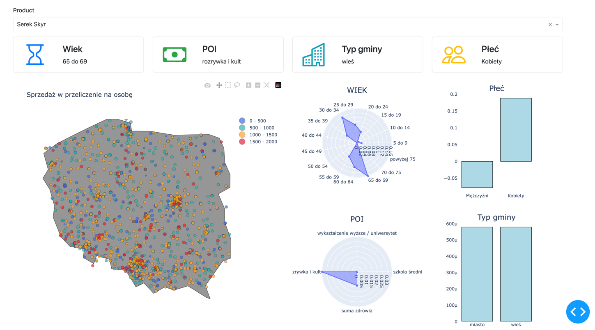

# TARGET GROUP PREDICTOR

Narzędzie analityczne do specyfikowania grupy docelowej produktu w oparciu o dane społeczno-demograficzne napędzane sztuczną intligencją

## Nasza wizja
 - Zestawienie danych społeczno demograficznych w “obszarze oddziaływania” danego sklepu
 - Wnioskowanie na podstawie porównania wyżej wymienionch danych i wysokości sprzedaży w danym sklepie 
 - Nie wymaga dodatkowych badań, ręcznych analiz, wszytsko wykonywane jest auomatycznie na podstawie dostępnych danych z wykorzystaniem AI

## Dane
 - wejścia do modelu (X) pobrane z locit.io na podstawie danych o lokazliacji punktów dystrybucji z raportów.
 - zmienna przewidywana - wolumen sprzedaży znormalizowany liczbą ludności (y) została wygenerowana w sposób syntetyczny - zakładamy, że dla każdego punktu sprzedaży dane te dla pewnego zagregowane okresu czasu dostępne są w systemie raportowania producenta.

## Podejście ML

 - w projekcie realizowano zadanie regresji, przetestowano działanie różnych algorytmów uczenia maszynowego (regresji liniowej, sieci neuronowe)

## Struktura projektu
 - `data` - folder z zebranymi zbiorami danych
 - `src` - skrypty do augumentowania, parsowania i przetwarzania danych
 - `visualize` - aplikacja dashboard
 - `notebooks` - eksploaryjna analiza danych i sprawdzenie modeli

## Uruchamianie dashboardu
- zainstaluj [pdm](https://pdm-project.org/en/latest/)
- `$ cd visualize/`
- `$ pdm install`
- `$ python3 src/visualize/main.py`
